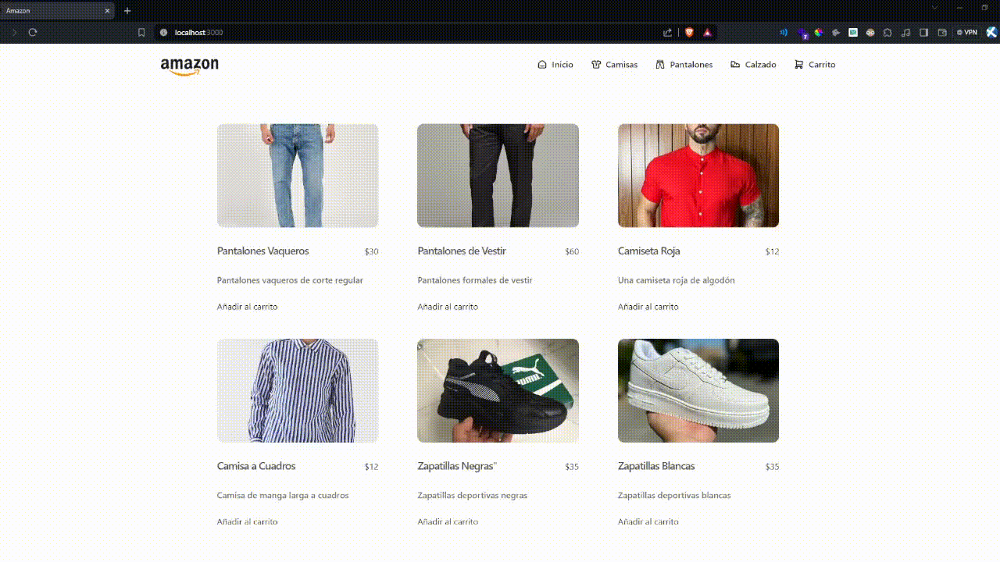

# Amazon Coderhouse Ecommerce

Este es el "Amazon", proyecto final del curso de React en Coderhouse. Hice un ecommerce creando componente reutilizables. A parte de React, usé Tailwind, Flowbite, Sonner y React Icons, esto me ayudó a agilizar el desarrollo del Frontend de la aplicación. También usé Firebase, más especificamente Firestore Database de Google para almacenar los productos y las ordenes de compras que hacen los usuarios. Sin mencionar que también estoy usando Github para administrar el código del proyecto.

## Routes

- Home `/`
- Categoria `/categoria/:categoryId`
- Item `/item/:id`
- Carrito `/cart`
- Not Found `/*`

## Demo

